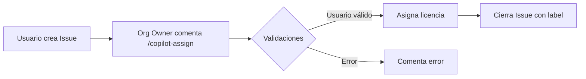
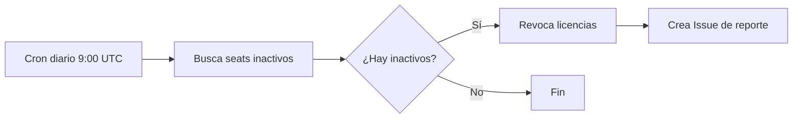

# IssueOps: Gestión de Licencias GitHub Copilot

<div align="center">

[](https://www.youtube.com/c/GiselaTorres?sub_confirmation=1)
[](https://github.com/0GiS0)
[](https://www.linkedin.com/in/giselatorresbuitrago/)
[](https://twitter.com/0GiS0)

</div>

---

¡Hola developer 👋🏻! Este repositorio contiene un flujo de trabajo **IssueOps** para gestionar licencias de **GitHub Copilot Business/Enterprise** de forma automatizada. Permite asignar licencias mediante comentarios en issues y realizar limpieza automática de seats inactivos.

## 📑 Tabla de Contenidos

- [IssueOps: Gestión de Licencias GitHub Copilot](#issueops-gestión-de-licencias-github-copilot)
  - [📑 Tabla de Contenidos](#-tabla-de-contenidos)
  - [✨ Características](#-características)
  - [🔄 Cómo Funciona](#-cómo-funciona)
    - [Asignación de Licencias](#asignación-de-licencias)
    - [Limpieza de Seats Inactivos](#limpieza-de-seats-inactivos)
  - [🛠️ Tecnologías Utilizadas](#️-tecnologías-utilizadas)
  - [📋 Requisitos Previos](#-requisitos-previos)
  - [⚙️ Configuración](#️-configuración)
    - [1. Crear GitHub App](#1-crear-github-app)
    - [2. Permisos de la App](#2-permisos-de-la-app)
    - [3. Configurar Repositorio](#3-configurar-repositorio)
    - [4. Validar Configuración](#4-validar-configuración)
  - [💻 Uso](#-uso)
    - [Solicitar una Licencia](#solicitar-una-licencia)
    - [Comandos Disponibles (Org Owners)](#comandos-disponibles-org-owners)
    - [Script Local (Opcional)](#script-local-opcional)
  - [📁 Estructura del Proyecto](#-estructura-del-proyecto)
  - [📝 Notas Importantes](#-notas-importantes)
  - [🌐 Sígueme en Mis Redes Sociales](#-sígueme-en-mis-redes-sociales)

## ✨ Características

- 🎫 **Asignación de licencias via IssueOps**: Los usuarios solicitan licencias creando issues
- 🤖 **Automatización completa**: Los org owners asignan licencias con un simple comando
- 🧹 **Limpieza automática**: Revoca licencias de usuarios inactivos (configurable)
- 📊 **Reportes detallados**: Job summaries con información de seats asignados y revocados
- 🔐 **Seguridad con GitHub Apps**: Autenticación mediante GitHub App (no PATs)
- ✅ **Validación de membresía**: Verifica que el usuario sea miembro activo de la organización

## 🔄 Cómo Funciona

### Asignación de Licencias



1. Un usuario crea una solicitud usando el **Issue Template**: *Request GitHub Copilot seat*
2. Un **organization owner** comenta en el issue:
   - `.copilot-assign` → Usa el username del formulario
   - `.copilot-assign @octocat` → Override explícito
3. El workflow valida permisos, membresía y asigna la licencia

### Limpieza de Seats Inactivos



- **Ejecución programada**: Diariamente a las 9:00 UTC (dry-run por defecto)
- **Ejecución manual**: Con opción de dry-run y días de inactividad configurables

## 🛠️ Tecnologías Utilizadas

- **GitHub Actions** - Orquestación de workflows
- **GitHub Apps** - Autenticación segura
- **GitHub REST API** - Gestión de Copilot seats
- **Bash** - Scripts de automatización
- **JavaScript/Node.js** - Scripts de procesamiento
- **GitHub Issue Templates** - Formularios de solicitud

## 📋 Requisitos Previos

- Organización con **GitHub Copilot Business** o **Enterprise**
- Permisos de **Organization Owner**
- **GitHub CLI** (`gh`) instalado (para scripts locales)

## ⚙️ Configuración

### 1. Crear GitHub App

Crea una GitHub App e instálala en tu organización.

> ⚠️ **Importante:** Los endpoints de Copilot billing están en preview. Si la API rechaza tokens de GitHub App (401/403), esta automatización no funcionará.

### 2. Permisos de la App

| Permiso | Nivel | Uso |
|---------|-------|-----|
| Organization members | Read | Validar membresía del usuario |
| Issues | Write | Comentar y cerrar issues |

### 3. Configurar Repositorio

```bash
# Variable
gh variable set COPILOT_APP_ID --body "TU_APP_ID"

# Secreto (el contenido del archivo .pem)
gh secret set COPILOT_APP_PRIVATE_KEY < path/to/private-key.pem
```

### 4. Validar Configuración

Ejecuta el workflow manualmente para validar:

1. Ve a **Actions** → **Copilot seat cleanup (inactivity)**
2. Click en **Run workflow**
3. Selecciona `dry_run: true`
4. Verifica que el token funciona correctamente

## 💻 Uso

### Solicitar una Licencia

1. Ve a **Issues** → **New Issue**
2. Selecciona **Request GitHub Copilot seat**
3. Completa el formulario con el username
4. Espera a que un org owner ejecute `.copilot-assign`

### Comandos Disponibles (Org Owners)

| Comando | Descripción |
|---------|-------------|
| `.copilot-assign` | Asigna licencia al usuario del issue |
| `.copilot-assign @user` | Asigna licencia a un usuario específico |

### Script Local (Opcional)

```bash
# Configurar variables
export ORG="tu-organizacion"
export GH_TOKEN="tu-token"

# Verificar membresía
./scripts/assign-copilot-seat.sh membership octocat

# Ver estado de Copilot
./scripts/assign-copilot-seat.sh status octocat

# Asignar licencia
./scripts/assign-copilot-seat.sh assign octocat
```

## 📁 Estructura del Proyecto

```
issueops-assign-ghcp-license/
├── .github/
│   ├── ISSUE_TEMPLATE/
│   │   └── request-copilot-seat.yml    # Formulario de solicitud
│   └── workflows/
│       ├── issueops-assign-copilot-seat.yml  # Asignación via IssueOps
│       └── copilot-seat-cleanup.yml          # Limpieza de inactivos
├── scripts/
│   ├── assign-copilot-seat.sh      # Helper para API calls
│   ├── parse-issue-username.js     # Extrae username del issue
│   ├── comment-and-close-issue.js  # Comenta y cierra issues
│   ├── find-inactive-seats.sh      # Busca usuarios inactivos
│   ├── revoke-inactive-seats.sh    # Revoca licencias
│   ├── create-cleanup-issue.js     # Crea issue de reporte
│   └── job-summary-cleanup.sh      # Genera job summary
└── README.md
```

## 📝 Notas Importantes

- Los endpoints de Copilot seat están en **preview** y pueden cambiar
- El workflow de asignación comenta, etiqueta y cierra el issue automáticamente
- La limpieza programada ejecuta en **dry-run** por defecto (solo reporta)
- Para revocar licencias, ejecuta manualmente con `dry_run: false`

## 🌐 Sígueme en Mis Redes Sociales

Si te ha gustado este proyecto y quieres ver más contenido como este, no olvides suscribirte a mi canal de YouTube y seguirme en mis redes sociales:

<div align="center">

[](https://www.youtube.com/c/GiselaTorres?sub_confirmation=1)
[](https://github.com/0GiS0)
[](https://www.linkedin.com/in/giselatorresbuitrago/)
[](https://twitter.com/0GiS0)

</div>
